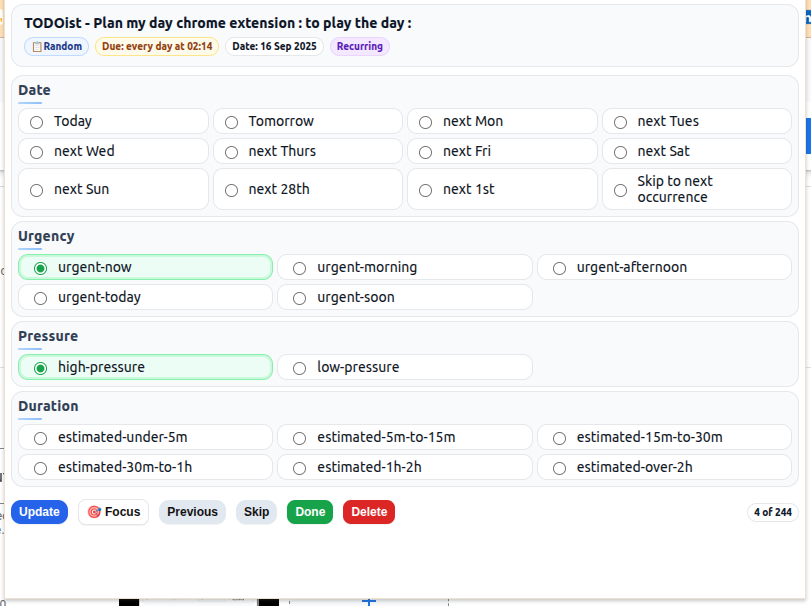

# Todoist – Plan My Day (Chrome Extension)

A lightweight Chrome Extension (Manifest V3) to plan your day with Todoist.

- Review overdue and today’s tasks one-by-one
- Quickly reschedule with convenient presets (Today, Tomorrow, next Mon–Sun)
- Add labels as you go (auto-creates missing labels)
- Search active tasks by keyword and jump into the same review flow


## Screenshots

Add your screenshots to the `docs/` folder with the following filenames (or update the paths below):

- Home screen with features: Plan‑my‑day and Search  
  

- Task review screen  
  

- Focus mode (timer, subtasks, insights, charts)  
  

- Search results list  
  


## Features

- Plan my day
  - Fetches both overdue and today’s active tasks from Todoist.
  - Reviews tasks one at a time with a consistent UI.
  - Reschedule presets: Today, Tomorrow, next Mon, next Tue, next Wed, next Thu, next Fri, next Sat, next Sun.
  - Project name is shown (not just the ID).
  - Labels can be applied/updated from checkboxes.
    - If a selected label doesn’t exist, it’s created first and then applied.
  - Previous/Skip controls:
    - Previous returns to the prior task in the planning flow.
    - If a task was opened from Search, Previous returns to Search results instead of the prior task.
  - Recurring tasks:
    - Uses the Sync API to reschedule the recurring item in‑place (no duplicate task). “Skip to next occurrence” is supported by completing the current instance.

- Focus mode
  - A distraction‑free page to work on the current task with a timer.
  - Nudges removed. The clock runs until manually stopped.
  - On stop, enter minutes focused; the extension adds to a cumulative label `actual-X` on the Todoist task (e.g. `actual-25`).
  - Shows the top 5 subtasks (sorted by due date if present, else by created time). Section hides automatically when there are no subtasks.
  - Main task and subtasks are clickable and open in Todoist.
  - Insights section:
    - Total tasks completed — last 30 days and last 7 days (bar charts).
    - Projectwise — last 30 days and last 7 days (line charts, consistent colors with bars).
    - Summary table — projectwise averages and max values, including Today column.
    - Charts highlight average and peak with dashed lines; axes simplified (30‑day y‑axis ticks at 0/8/16/24…; others in 4s). Graphs reload when re‑entering an active session.

- Search tasks
  - Keyword search entry on the home screen.
  - Shows a loading message while searching.
  - Lists up to 50 active tasks that contain the keyword.
  - Clicking a result opens the same task review flow.
  - Pressing Enter in the search field triggers the same action as clicking Search.
  - Back button returns to the home screen; Previous (from a searched task) returns to the Search results list.
  - Uses `https://app.todoist.com/api/v1/completed/search?query=<keyword>` to help resolve matching context, and then filters active tasks client-side to display only active results.
  - Includes a REST fallback and a client-side filter fallback if the search endpoint fails.

- Polished home UI
  - Clear separation between the Plan and Search features.
  - Small app icon in the page title.


## Installation

1. Clone or download this repository.
2. Open Chrome and go to `chrome://extensions`.
3. Enable "Developer mode" (top right).
4. Click "Load unpacked" and select the `todoist-planner` folder.


## First-time Setup

- When the popup opens, paste your Todoist API token (Settings → Integrations → API token). The token is saved in `chrome.storage.sync` only.
- Click "Start planning" to begin.


## Permissions

The extension uses the following permissions:

- `storage` – to save your Todoist API token locally in Chrome sync storage
- `host_permissions` –
  - `https://api.todoist.com/*` for the REST API (tasks, labels, projects)
  - `https://app.todoist.com/*` for the search helper endpoint


## How it Works (APIs)

- Tasks
  - Fetch overdue + today: `GET /rest/v2/tasks?filter=overdue | today`
  - Update task (date/labels): `POST /rest/v2/tasks/{id}` with `{ due_date, labels }`
  - Recurring reschedule in‑place (no duplicate): `POST https://api.todoist.com/sync/v9/sync` with an `item_update` command.

- Labels
  - Preload: `GET /rest/v2/labels`
  - Create missing: `POST /rest/v2/labels` with `{ name }`

- Projects
  - Preload: `GET /rest/v2/projects` (used to display project names)

- Search (hybrid)
  - App endpoint: `GET https://app.todoist.com/api/v1/completed/search?query=<keyword>`
  - Then fetch active tasks and filter client-side to show only active matches (up to 50).

- Insights data
  - Completed items: `GET https://api.todoist.com/sync/v9/completed/get_all?since=<ISO>` (aggregated client‑side into daily totals and per‑project totals)


## Recurring Tasks – Date Changes

Recurring tasks are updated in‑place using the Sync API so Todoist preserves the recurrence pattern. Choosing “Skip to next occurrence” completes the current instance to advance the schedule.


## Development

- Stack: Plain HTML/CSS/JS, Manifest V3
- Files of interest:
  - `todoist-planner/popup.html` – Popup UI
  - `todoist-planner/popup.css` – Styling
  - `todoist-planner/popup.js` – All logic for planning, search, and API calls
  - `todoist-planner/manifest.json` – MV3 manifest

- Token storage: `chrome.storage.sync`
- No background service worker required for this popup-only workflow.


## Privacy

- Your Todoist API token is stored locally in `chrome.storage.sync` on your own browser profile.
- No analytics or tracking are included.


## Troubleshooting

- Seeing project ID instead of project name? It’s likely the project list hasn’t finished loading. The extension preloads projects; re-opening the popup should resolve it quickly.
- Search returns no results: The extension falls back to client-side filtering of active tasks; try a broader keyword.
- Recurring task date “snaps back”: This is Todoist’s recurrence behavior. The extension also creates a one-off dated copy to preserve your intent for immediate action.


## License

MIT

## Recent Updates

- Focus mode revamp: removed nudges; manual stop with minutes accumulates to `actual-X` label.
- Subtasks preview on focus page (top 5, sorted); auto-hide when none.
- Insights: totals and projectwise charts (30d, 7d), projectwise summary table, and color‑consistent palette.
- Chart polish: cleaner axes (30d ticks at 8s), average and peak lines, improved legibility, and automatic reload when resuming focus.
- New urgency labels: `urgent-morning` and `urgent-afternoon` (placed after `urgent-now`).
- UI refinements to keep the popup scroll‑free and readable.

## Google Apps Script Automation (Hourly Planner + Email)

Use the included Apps Script to automatically rank and time‑block your top Todoist tasks every 30 minutes (aligned to :00 and :30 in IST), email a report, and set a Todoist reminder at the task’s due time.

### What it does
- **Ranks tasks**: Fetches active tasks due “today | overdue”, applies priority rules, assigns unique ranks starting at 1.
- **Time‑blocks top tasks**: **Top 10** tasks get due times starting at “run time + 5 minutes” in `Asia/Kolkata`, then every 10 minutes; others keep the date but have their time removed.
- **Emails a report**: Sends a ranked table to your inbox.
- **Sets Todoist reminders**: For each updated task, creates a reminder at the exact due time (relative 0 minutes).

### Files
- Script source: `todoist-planner/scripts/reschedular-script.js`

### One‑time setup (Apps Script)
1. Go to `script.google.com`, create a new standalone project.
2. In the editor, File → Project properties → set **Time zone** to `Asia/Kolkata`.
3. Create a file named `reschedular-script.js` and paste the contents of `todoist-planner/scripts/reschedular-script.js`.
4. Open the script and configure constants near the top:
   - `TOKEN_PROP_KEY`: set to your Todoist REST API token string (from Todoist → Settings → Integrations → API token).
   - `EMAIL_TO`: set your email address for the report.
   - `TARGET_TZ`: keep as `Asia/Kolkata` (or change to your IANA timezone).
   - Optional: `TOP_N` (default 10) to control how many tasks get time‑blocked.
5. Click Run → select `run` → authorize when prompted.
   - Check the execution logs for a line like: “Planner first slot (IST): now=… → first=…”. The “first” time should be 5 minutes after “now”.
   - You should also receive the email report.

### Scheduling every 30 minutes, aligned to :00 and :30 (IST)
- In Apps Script editor, left sidebar → **Triggers** → **Add Trigger** twice:
  - Trigger 1: Function `run`, Event source `Time-driven`, Type `Hour timer`, Every hour, Minute `0`.
  - Trigger 2: Function `run`, Event source `Time-driven`, Type `Hour timer`, Every hour, Minute `30`.
- Ensure your project’s Time zone is `Asia/Kolkata` so triggers fire aligned to IST.

Optionally, you can create triggers programmatically by adding this function and running it once:

```javascript
function setupTriggers() {
  // Remove existing time-based triggers for 'run'
  ScriptApp.getProjectTriggers().forEach(tr => {
    if (tr.getHandlerFunction() === 'run' && tr.getEventType() === ScriptApp.EventType.CLOCK) {
      ScriptApp.deleteTrigger(tr);
    }
  });

  // Hourly at :00 IST
  ScriptApp.newTrigger('run')
    .timeBased()
    .everyHours(1)
    .nearMinute(0)
    .inTimezone('Asia/Kolkata')
    .create();

  // Hourly at :30 IST
  ScriptApp.newTrigger('run')
    .timeBased()
    .everyHours(1)
    .nearMinute(30)
    .inTimezone('Asia/Kolkata')
    .create();
}
```

### Permissions
- Uses `UrlFetchApp` to call the Todoist REST and Sync APIs.
- Uses `MailApp` to send the report email.

### Notes and troubleshooting
- **Reminders**: The script adds a Todoist reminder at the exact due time (relative, 0 minutes). Re‑running may add additional reminders for the same task/time; a dedupe step can be added if needed.
- **Timezone**: Set project Time zone to `Asia/Kolkata` and keep `TARGET_TZ` consistent. The email and schedule use this timezone.
- **First slot**: Computed as “execution now + 5 minutes”. Check logs for “Planner first slot (IST)” to verify alignment.
- **Rate limiting**: The script sleeps between requests to stay under Todoist limits.
- **API token security**: Do not commit your token. Keep it in the script constant or adapt the script to read from project properties.

