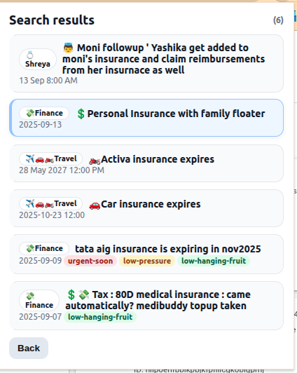

# Todoist – Plan My Day (Chrome Extension)

A lightweight Chrome Extension (Manifest V3) to plan your day with Todoist.

- Review overdue and today’s tasks one-by-one
- Quickly reschedule with convenient presets (Today, Tomorrow, next Mon–Sun)
- Add labels as you go (auto-creates missing labels)
- Search active tasks by keyword and jump into the same review flow

## Screenshots

Add your screenshots to the `docs/` folder with the following filenames (or update the paths below):

- Home screen with features
  
  

- Task review screen
  
  

- Search keyword entry (home)
  
  

- Search results list
  
  

## Features

- Plan my day
  - Fetches both overdue and today’s active tasks from Todoist.
  - Reviews tasks one at a time with a consistent UI.
  - Reschedule presets: Today, Tomorrow, next Mon, next Tue, next Wed, next Thu, next Fri, next Sat, next Sun.
  - Project name is shown (not just the ID).
  - Labels can be applied/updated from checkboxes.
    - If a selected label doesn’t exist, it’s created first and then applied.
  - Previous/Skip controls:
    - Previous returns to the prior task in the planning flow.
    - If a task was opened from Search, Previous returns to Search results instead of the prior task.
  - For recurring tasks:
    - The extension updates the recurring task’s `due_date` to your chosen date and, in parallel, creates a one-off copy for tomorrow with the same labels. This avoids fighting Todoist’s recurrence engine and preserves the recurring chain.

- Search tasks
  - Keyword search entry on the home screen.
  - Shows a loading message while searching.
  - Lists up to 50 active tasks that contain the keyword.
  - Clicking a result opens the same task review flow.
  - Pressing Enter in the search field triggers the same action as clicking Search.
  - Back button returns to the home screen; Previous (from a searched task) returns to the Search results list.
  - Uses `https://app.todoist.com/api/v1/completed/search?query=<keyword>` to help resolve matching context, and then filters active tasks client-side to display only active results.
  - Includes a REST fallback and a client-side filter fallback if the search endpoint fails.

- Polished home UI
  - Clear separation between the Plan and Search features.
  - Small app icon in the page title.

## Installation

1. Clone or download this repository.
2. Open Chrome and go to `chrome://extensions`.
3. Enable "Developer mode" (top right).
4. Click "Load unpacked" and select the `todoist-planner` folder.

## First-time Setup

- When the popup opens, paste your Todoist API token (Settings → Integrations → API token). The token is saved in `chrome.storage.sync` only.
- Click "Start planning" to begin.

## Permissions

The extension uses the following permissions:

- `storage` – to save your Todoist API token locally in Chrome sync storage
- `host_permissions` –
  - `https://api.todoist.com/*` for the REST API (tasks, labels, projects)
  - `https://app.todoist.com/*` for the search helper endpoint

## How it Works (APIs)

- Tasks
  - Fetch overdue + today: `GET /rest/v2/tasks?filter=overdue | today`
  - Update task (date/labels): `POST /rest/v2/tasks/{id}` with `{ due_date, labels }`
  - Create one-off task: `POST /rest/v2/tasks` with `{ content, project_id, due_date, labels }`

- Labels
  - Preload: `GET /rest/v2/labels`
  - Create missing: `POST /rest/v2/labels` with `{ name }`

- Projects
  - Preload: `GET /rest/v2/projects` (used to display project names)

- Search (hybrid)
  - App endpoint: `GET https://app.todoist.com/api/v1/completed/search?query=<keyword>`
  - Then fetch active tasks and filter client-side to show only active matches (up to 50).

## Recurring Tasks – Date Changes

- Recurring tasks frequently snap back to the next recurrence when their date is changed directly. To avoid confusion while still supporting your workflow, this extension:
  - Updates the recurring task’s `due_date` to your selected preset, and
  - In parallel, creates a one-off copy due tomorrow with the same labels.

This preserves the recurring chain while also giving you a dated task to act on.

## Development

- Stack: Plain HTML/CSS/JS, Manifest V3
- Files of interest:
  - `todoist-planner/popup.html` – Popup UI
  - `todoist-planner/popup.css` – Styling
  - `todoist-planner/popup.js` – All logic for planning, search, and API calls
  - `todoist-planner/manifest.json` – MV3 manifest

- Token storage: `chrome.storage.sync`
- No background service worker required for this popup-only workflow.

## Privacy

- Your Todoist API token is stored locally in `chrome.storage.sync` on your own browser profile.
- No analytics or tracking are included.

## Troubleshooting

- Seeing project ID instead of project name? It’s likely the project list hasn’t finished loading. The extension preloads projects; re-opening the popup should resolve it quickly.
- Search returns no results: The extension falls back to client-side filtering of active tasks; try a broader keyword.
- Recurring task date “snaps back”: This is Todoist’s recurrence behavior. The extension also creates a one-off dated copy to preserve your intent for immediate action.

## License

MIT
